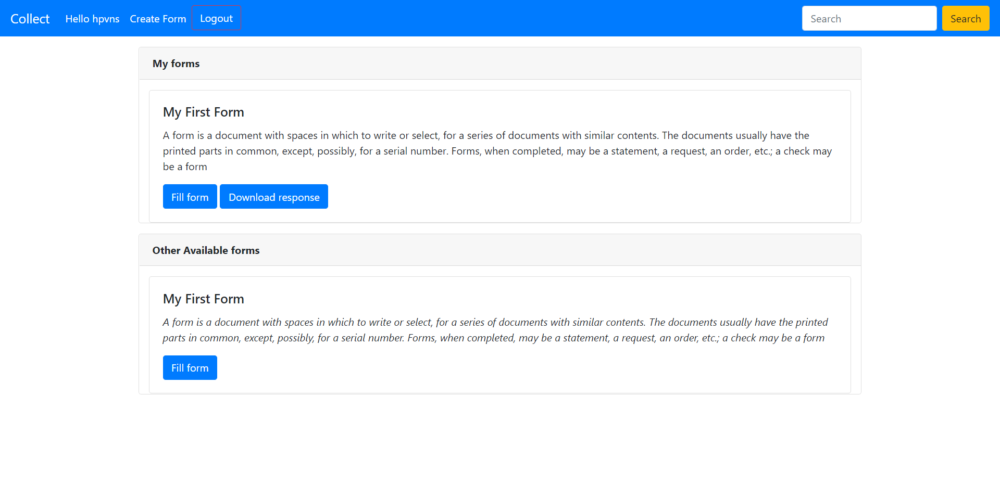

**Collect Portal for Atlan Assignment**

Process of Installation

1. Download and upzip the collect folder.
2. navigate to /collect  folder using `cd <path to collect>` command.
3. Run `dir`  and make sure manage.py is visible. If not your step 2 is incorrect. Try to repeate again.
4. RUN `pip install requirements.py `
5. Run `python manage.py runserver`
6. Go to `localhost:8000` on browser

7. Register a new user and login.
8. Click on create form to create form.
9. Fill the form . Download Response.
# google-forms-clone
